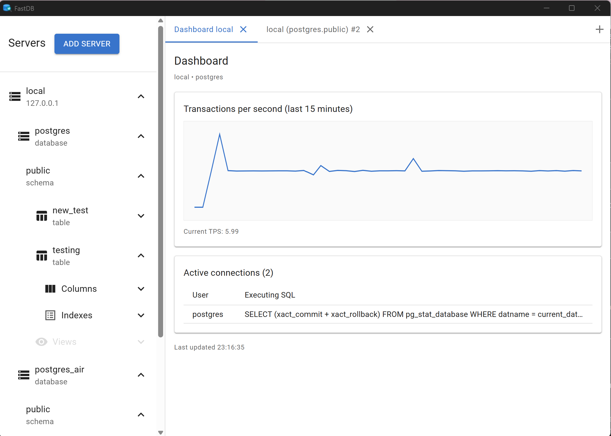
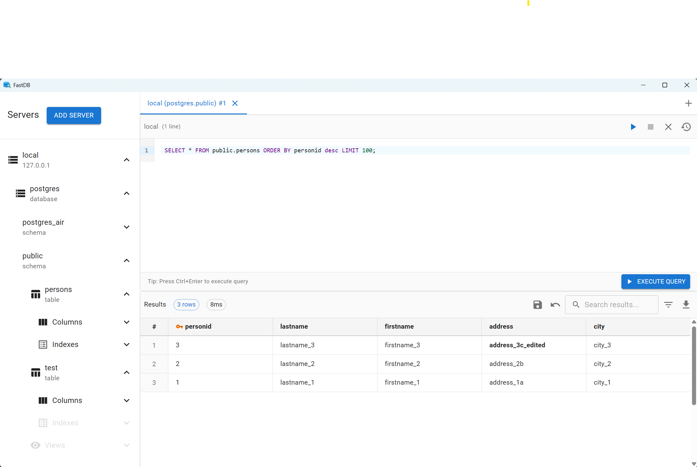

# FastDB

> A blazingly fast, lightweight PostgreSQL query tool for Windows

FastDB is a desktop application built with Tauri and React that provides a modern, high-performance interface for querying and managing PostgreSQL databases. Designed for speed and efficiency, it achieves sub-200ms startup times and handles result sets with 100,000+ rows without breaking a sweat.

## ✨ Features

### 🎯 Core Capabilities
- **Multi-tab interface** - Execute multiple queries simultaneously across different servers
- **Smart caching** - Schema metadata cached locally for instant tree navigation
- **Query history** - All successful queries saved per server
- **Export results** - One-click CSV export with proper escaping
- **Click-to-copy** - Copy any cell value with a single click
- **Real-time search** - Filter large result sets instantly

### 🔒 Security
- **Windows Credential Manager** - Passwords stored securely in OS keychain, never in database
- **No plaintext secrets** - Zero passwords on disk
- **Connection pooling** - Efficient, secure connection reuse

### 🎨 User Experience
- **Material UI design** - Clean, professional interface
- **Keyboard shortcuts** - Ctrl+Enter to execute, Tab for indentation
- **Expandable tree** - Server → Schema → Table → Column hierarchy
- **Error handling** - Clear, actionable error messages
- **Responsive layout** - Adapts to window size

## 📸 Screenshots

### Dashboard


### Editing Column



## 🚀 Quick Start

### Prerequisites
- **Windows 10/11** (required for Credential Manager)
- **Node.js** 18+ and npm 9+
- **Rust** 1.85+ (install via [rustup](https://rustup.rs/))
- **PostgreSQL** server(s) to connect to

### Installation

```bash
# Clone the repository
git clone https://github.com/tesmond/fastdb.git
cd fastdb

# Install frontend dependencies
npm install

# Build and run
npm run tauri dev
```

### Build for Production

```bash
# Build optimized release
npm run tauri build

# Find executable in:
# src-tauri\target\release\fastdb.exe
```

## 📖 Usage

### Adding a Server

1. Click the **+** button in the server panel
2. Enter connection details:
   - Name (display name)
   - Host (e.g., localhost or IP)
   - Port (default: 5432)
   - Database name
   - Username
   - Password (stored securely in Windows Credential Manager)
3. Click **Test Connection** to verify
4. Click **Save**

### Executing Queries

1. Select a server from the left panel
2. Click **+** to create a new query tab
3. Type your SQL query
4. Press **Ctrl+Enter** or click **▶ Execute**
5. View results in the bottom panel

### Keyboard Shortcuts

| Shortcut | Action |
|----------|--------|
| `Ctrl+Enter` | Execute query |
| `Tab` | Insert 2 spaces (indent) |
| `Ctrl+T` | New tab (future) |
| `Ctrl+W` | Close tab (future) |

## 🏗️ Architecture

### Technology Stack

**Frontend:**
- React 18.2 with hooks
- Vite 5.0 for blazing fast builds and HMR
- Material-UI 5.11 for components
- react-window for virtualization
- Tauri API for backend communication

**Backend:**
- Rust with Tokio async runtime
- rusqlite for local metadata storage
- tokio-postgres for database connections
- deadpool-postgres for connection pooling
- Windows Credential Manager for password storage

## 🛣️ Roadmap

### Phase 5 (Management)
- [x] Edit columns with primary ID
- [ ] Server management UI (add/edit/delete)
- [ ] Saved queries with folders
- [ ] Advanced filtering (type-specific)
- [ ] Export to JSON/Excel
- [ ] Dark mode theme

### Phase 6 (Advanced)
- [ ] Query plan visualization (EXPLAIN)
- [ ] Multi-statement execution
- [ ] Transaction management
- [ ] Schema comparison tools
- [ ] Cross-platform support (macOS, Linux)

## 🤝 Contributing

Contributions are welcome! Please feel free to submit a Pull Request.

### Development Setup

```bash
# Install dependencies
npm install

# Run in development mode
npm run tauri dev

# Build for production
npm run build

# Format code
cargo fmt
```

### Unit Tests

```bash
# Run unit tests once
npm test

# Run unit tests in watch mode
npm run test:watch

# Run unit tests once with coverage
npm run test:coverage
```

### Code Style
- **Rust:** Follow standard Rust conventions (rustfmt)
- **JavaScript:** ESLint + Prettier configuration
- **Commits:** Conventional Commits format

## 📄 License

MIT License - see [LICENSE](LICENSE) file for details

## 🙏 Acknowledgments

- [Tauri](https://tauri.app/) - Desktop app framework
- [Vite](https://vitejs.dev/) - Next generation frontend tooling
- [Material-UI](https://mui.com/) - React component library
- [rusqlite](https://github.com/rusqlite/rusqlite) - SQLite bindings
- [tokio-postgres](https://github.com/sfackler/rust-postgres) - PostgreSQL driver
- [react-window](https://react-window.vercel.app/) - Virtualization library

## 📞 Support

- **Issues:** [GitHub Issues](https://github.com/tesmond/fastdb/issues)
- **Discussions:** [GitHub Discussions](https://github.com/tesmond/fastdb/discussions)

## 📊 Status

- ✅ Phase 1: Architecture & Design (Complete)
- ✅ Phase 2: Backend Core (Complete)
- ✅ Phase 3: Frontend UI (Complete)
- ✅ Phase 4: Advanced Features (Complete)
- 🚧 Phase 5: Management (In Progress)

**Current Version:** 0.2.0  
**Status:** Beta  
**Last Updated:** 2026

---

Built with ⚡ Vite, React, and Rust
